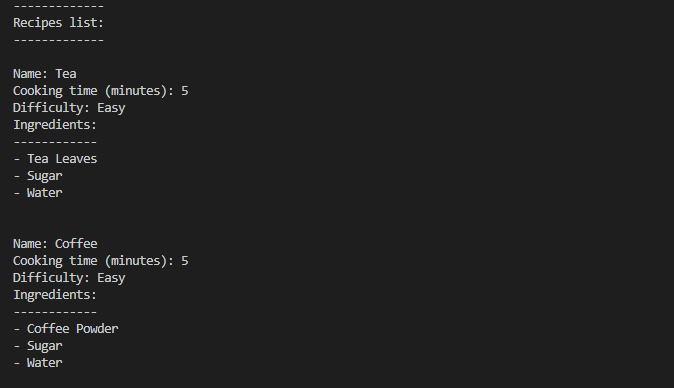

# Python for Web Developers
## Task 1.5
# Object-Oriented Programming in Python

In the recipe_oop.py the class 'Recipe' is defined and this class has data attributes, and defines the procedural attributes for 'Recipe' as well. It defines a method called recipe_search() and runs a for loop that traverses through the data.

