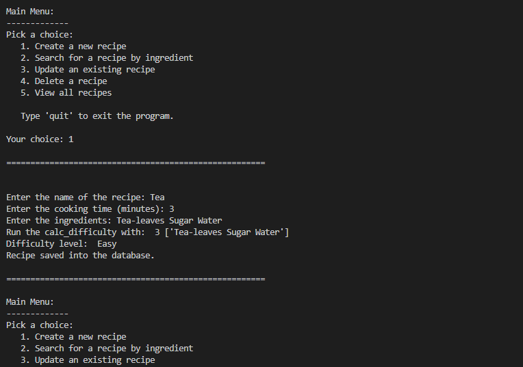
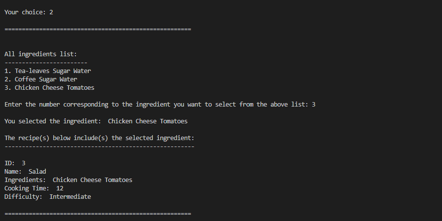
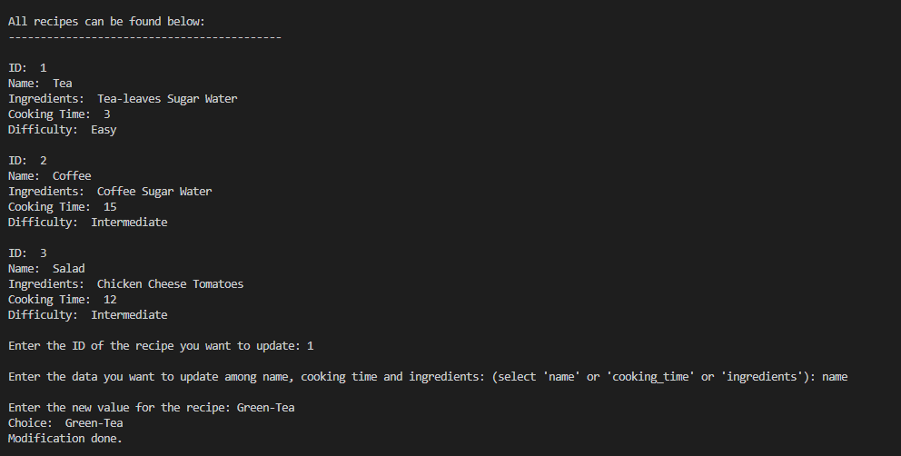
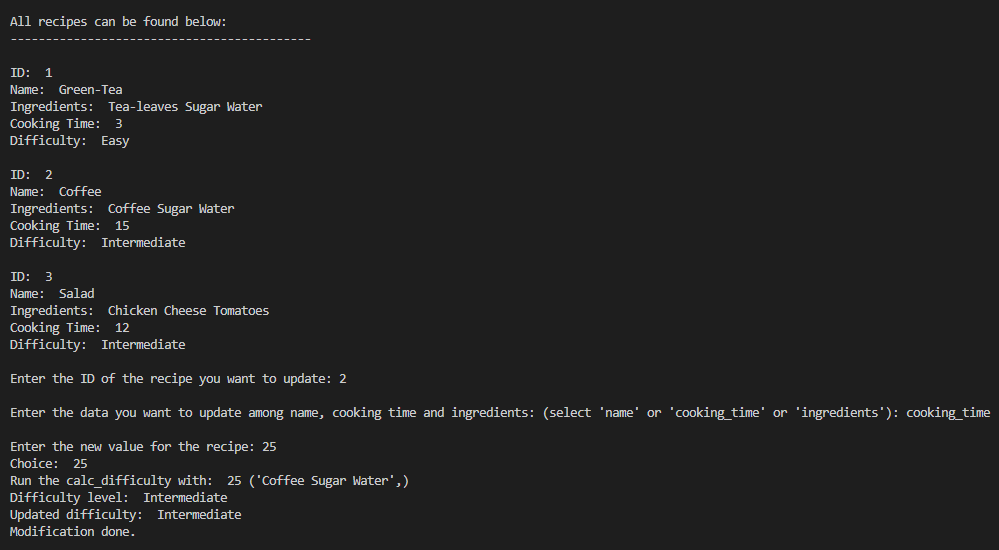
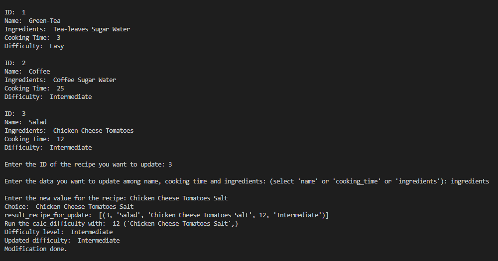
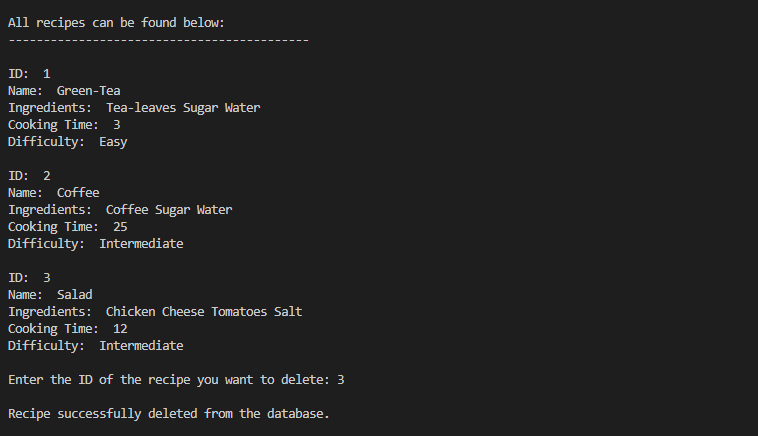
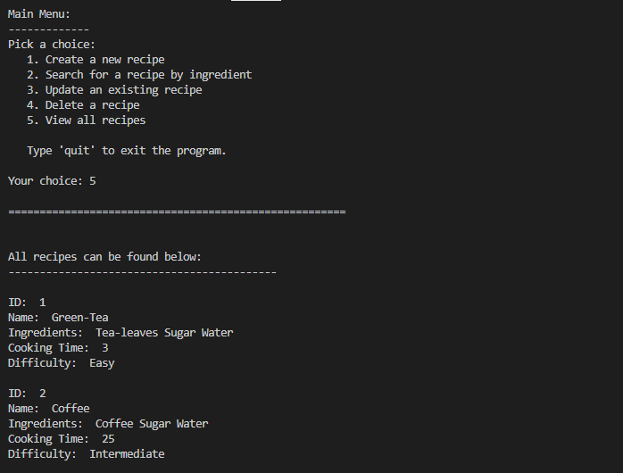

# Python for Web Developers
## Task 1.6
# Databases in Python

recipe_mysql.py is a script that connects to a local database via mySQL and allows users to enter new recipes, search for recipes by ingredient, edit (update) recipes, and delete recipes.

Create recipes:

Search recipe:

Update name:

Update cooking time:

Update ingredients:

Delete recipe:

View all the recipes:

Quit:
