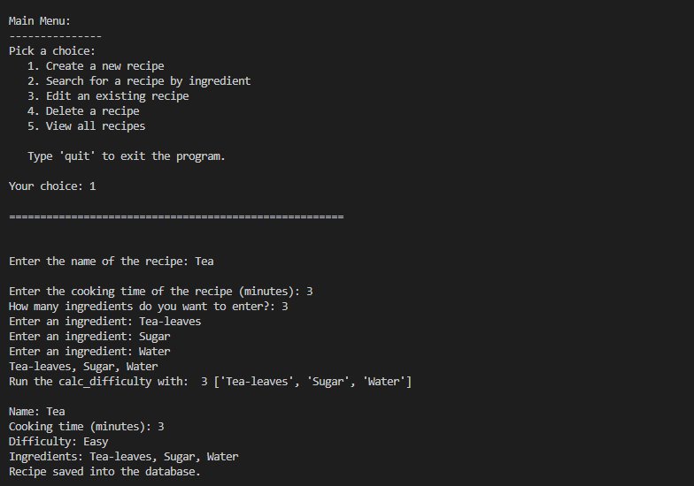
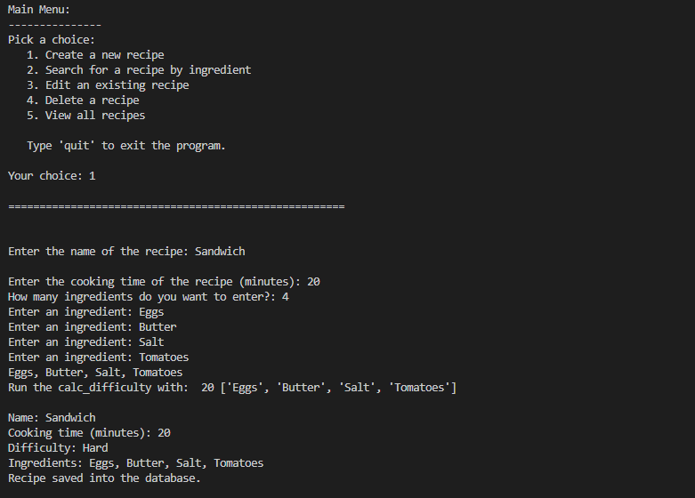
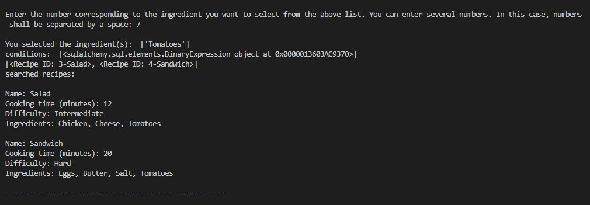
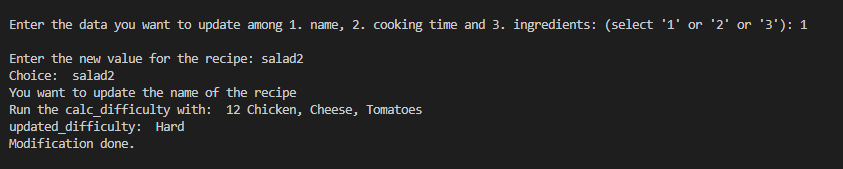
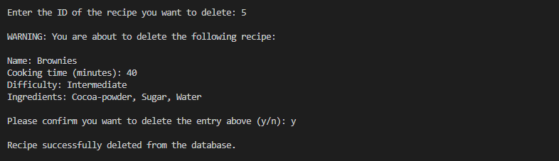
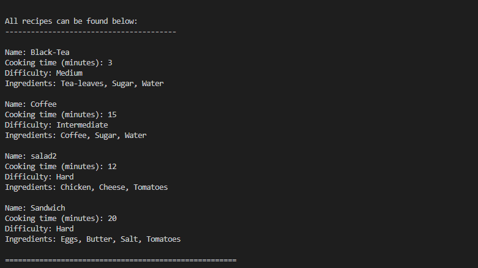

# Python for Web Developers
## Task 1.7
## Object-Relational Mapping in Python

recipe_app.py is a script that allows users to pick whether they want to create a new recipe, search recipe ingredients, edit a recipe, delete a recipe, or view all recipes.

Create recipes:

Search recipe:

Update recipe:

Delete recipe:

View all the recipes:

